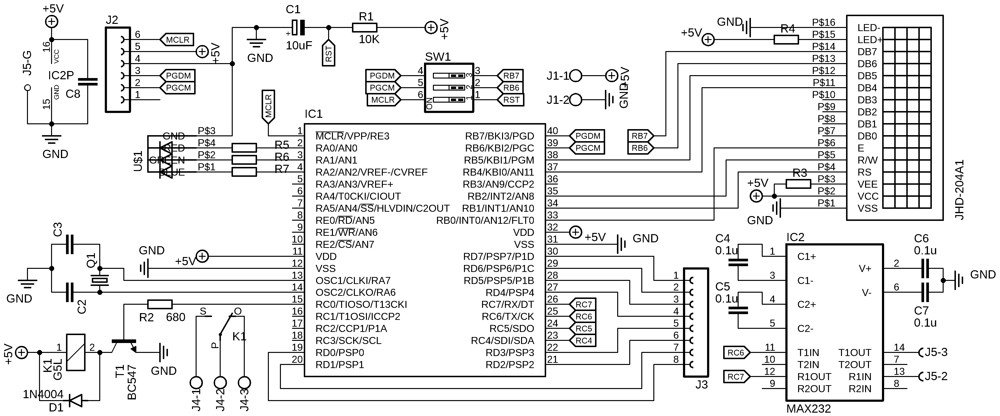

# Communication Protocols & Interfaces
This repository includes different projects that show my coding skills for microcontroller programming. The projects go from using the microcontroller's ports to output a binary counter to creating a complex Point Of sale by communicating two microcontrollers as Master-Slave. All the projects are coded using C language and Microchip CCS PIC Compiler using the PIC18F4550 microcontroller. 

Most of the projects use a PCB designed by myself which include many different embedded systems to start interacting with the microcontroller. Some of the included components are:
* 1 - 4x20 LCD Display
* 1 - RGB LED
* 1 - Relay
* 1 - RS232 Communication Port

With the following Schematic

Some projects that include Master-Slave or USB Communication use another board for these purposes. Because of Copyright conflicts I am not able to display many information about this board but some of the features it included are:
* 1 - 2x16 LCD Display
* 2 - LED 7 Segment Displays
* 4 - Push Buttons
* 1 - RS232 Communication Port
* 1 - USB Communication Port
* 1 - I2C Communication Port
